# LockedIn

**Lock your phone, lock in.** LockedIn is a focus timer for iPhone that only runs while your phone is locked. Unlock it and the timer stops. Lock it again and the timer picks back up. Every session is saved, so you can see how much you really focused: daily totals, streaks, and trends.

<p align="center">
  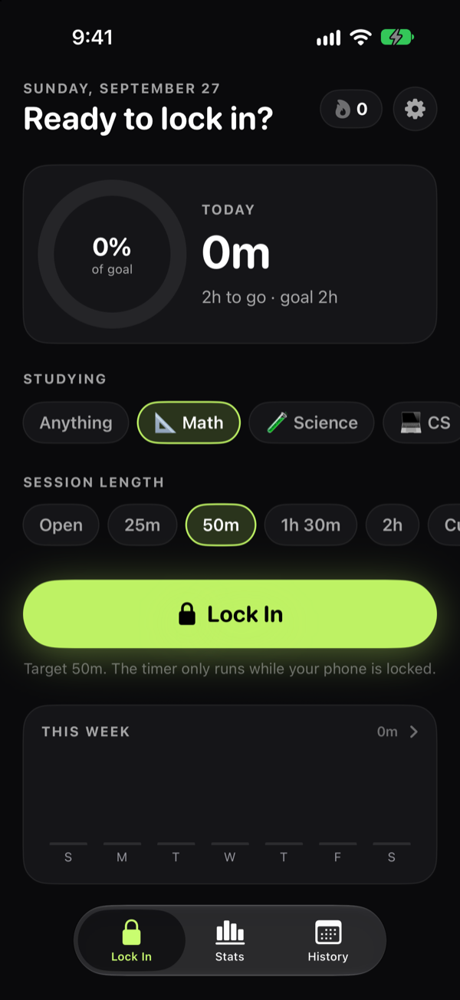
  &nbsp;
  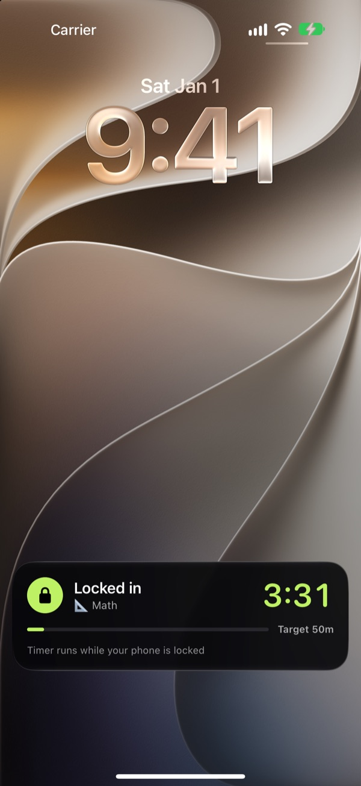
  &nbsp;
  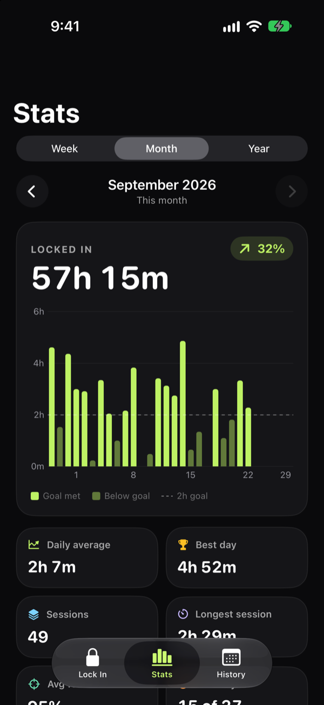
</p>

## What you can do

- **Focus by locking your phone.** Pick what you're studying, optionally set a target (25m, 50m, 1h 30m…), tap **Lock In**, and put the phone down. The timer only counts while the screen is locked.
- **See the timer without unlocking.** A Live Activity on the Lock Screen and in the Dynamic Island shows the running time and your progress toward the target.
- **Unlock = stop.** Picking up your phone stops the clock instantly, in any app. Each unlock is counted, so you can see how often you checked your phone.
- **Take real breaks.** Pause a session for a break and set a 5–30 minute reminder. Break time doesn't count against your focus score.
- **Hit a daily goal and build streaks.** Set a daily goal, watch the ring fill up, and keep your streak going.
- **See where your time goes.** Week, month, and year charts, a subject breakdown, your best hours of the day, and plain-English insights like "Up 32% from this point last month."
- **Look back at every session.** A calendar heatmap of your history, with a timeline of each session's locked stretches and unlocks.
- **Keep your data.** Everything stays on your iPhone: no account, no servers. You can export it all to CSV anytime.

## How a session works

| 1. Pick a subject and length | 2. Tap Lock In, then lock your phone | 3. Watch the timer on the Lock Screen |
| :---: | :---: | :---: |
|  | 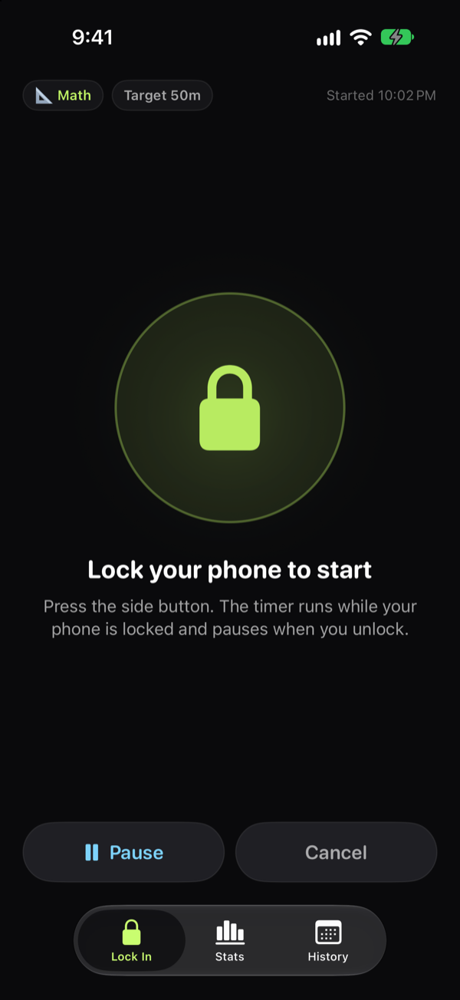 |  |

| 4. Unlock and the timer stops | 5. End it and get your summary |
| :---: | :---: |
| 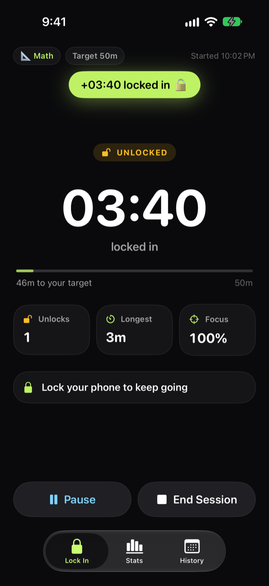 | 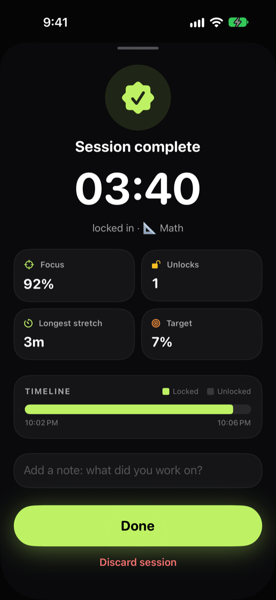 |

## Tour

| Stats | Insights and subjects | History | Session detail |
| :---: | :---: | :---: | :---: |
|  | 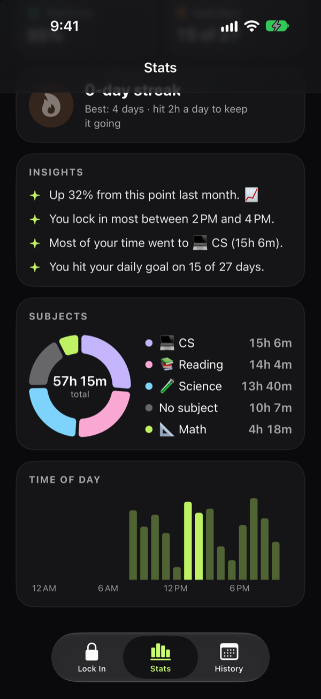 | 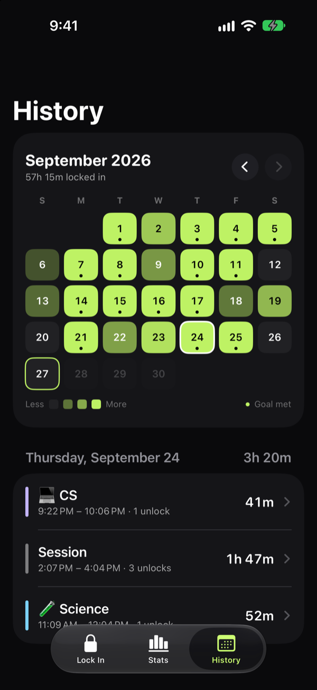 | 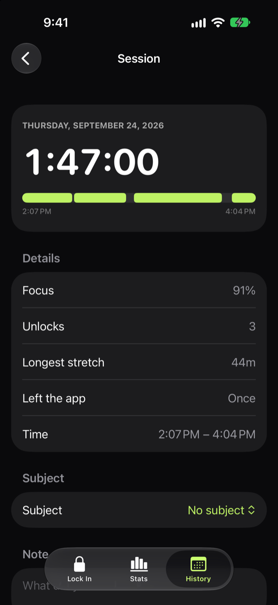 |

| Onboarding | How it works | Daily goal | Settings |
| :---: | :---: | :---: | :---: |
| 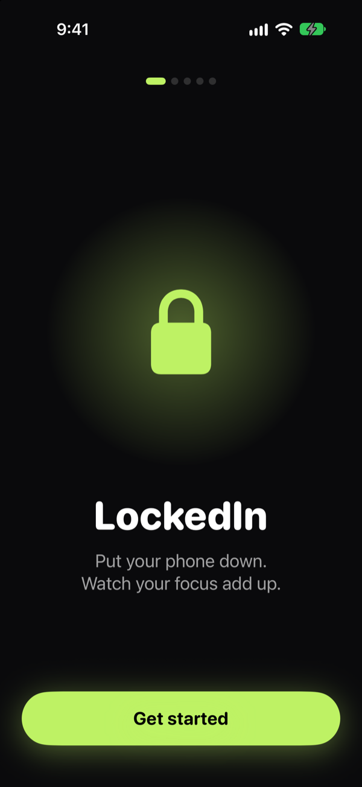 | 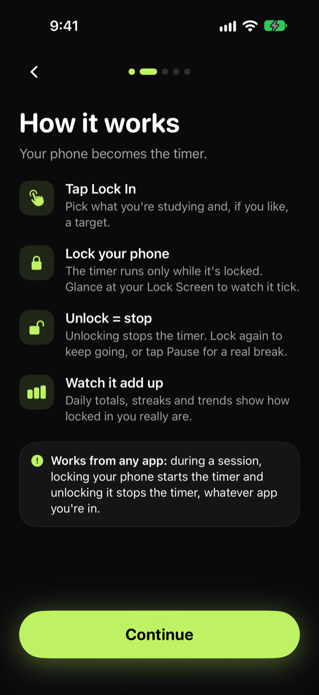 | 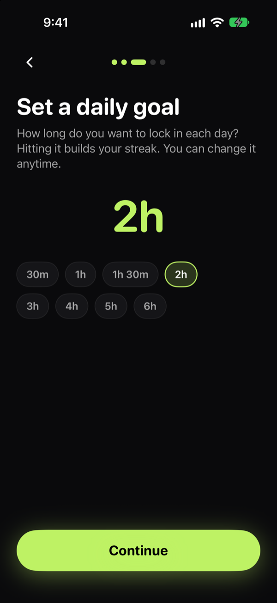 | 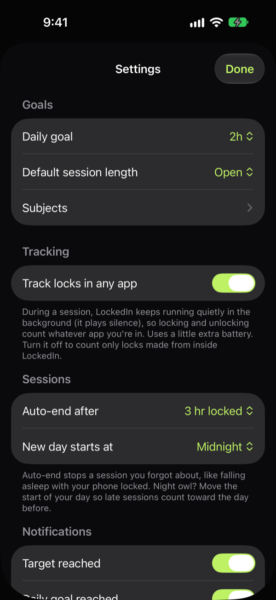 |

<sub>Screenshots are from the iOS Simulator with the app's built-in sample data.</sub>

## Run it on your iPhone

1. Open `LockedIn.xcodeproj` in Xcode.
2. Connect your iPhone and pick it as the run destination.
3. Press **Run** (⌘R). Signing uses your Personal Team (set in `project.yml`).
4. First time only:
   - Turn on **Developer Mode** (Settings → Privacy & Security → Developer Mode).
   - Trust your developer certificate (Settings → General → VPN & Device Management).

Apps signed with a free Personal Team expire after 7 days. Press Run again; your data stays.

## How lock detection works

During a session, locking your phone starts the timer and unlocking stops it, whatever app you're in.

- **Staying awake:** iOS normally suspends an app you've left, and a suspended app hears nothing. So during a session LockedIn keeps running in the background by playing silence through a mixable audio session. It never interrupts your music, and it stops when the session ends.
- **Unlock:** iOS makes the phone's protected data available the moment it unlocks, so the timer stops immediately, whatever app the phone opens to.
- **Lock:** iOS signals the lock the moment it happens, so the timer resumes right away, whatever app is open.
- **Lock Screen updates:** iOS ignores Live Activity updates from an app that's awake only to play background audio. So LockedIn holds a brief background task for each update, which iOS accepts.
- **Locking from inside LockedIn** also works without background tracking: iOS reports the lock as LockedIn leaves the screen. Without a passcode, LockedIn goes by timing instead: a lock takes the app off screen within milliseconds, while going Home animates first.

Turn off **Settings → Track locks in any app** to go back to counting only locks made from inside LockedIn. That mode uses no background audio.

**Pause** holds a session for a real break. Locking the phone won't count until you tap **Resume**, and you can pick a 5–30 minute reminder. Background tracking stops while paused. A pause over 4 hours ends the session. Break time doesn't count against focus %.

**Things to know**

- A quick Face ID glance at the Lock Screen unlocks the phone, so it pauses the timer until the phone locks again.
- The background audio costs a little battery. The auto-end limit (default: 3 hours locked) and the one-hour unlocked limit stop forgotten sessions, and the audio with them.
- Without a device passcode there are no lock signals, so only locks made from inside LockedIn count.
- The App Store doesn't allow silent audio just to stay awake. Publishing would mean turning it into audible focus sounds.

## Test it on your phone

Start a session, then try each of these:

1. Lock for 2 minutes, then unlock. You should see about 2:00 credited and 1 unlock.
2. Go Home and open another app. The Dynamic Island timer should stay stopped.
3. From that other app, lock the phone for a minute, then unlock straight into it. The timer should run while locked and stop the moment you unlock.
4. Lock and unlock quickly (under 10 seconds) from inside LockedIn. That time should still count.
5. Play music in another app during a session. It should keep playing normally.

Then open **Settings → Diagnostics → Copy log**. The log shows every lock decision with its timing, which is what's needed to tune detection.

## Project layout

| Folder | What's inside |
| --- | --- |
| `LockedIn/Engine` | Session state machine, lock detector, Live Activity and notification controllers, diagnostics log |
| `LockedIn/Data` | SwiftData models, settings, stats calculations, CSV export, sample data |
| `LockedIn/Features` | Screens: Onboarding, Home, Session, Stats, History, Settings |
| `LockedIn/DesignSystem` | Shared UI pieces (cards, ring, chips, buttons, timeline) |
| `LockedInWidgets` | Lock Screen / Dynamic Island Live Activity |
| `Shared` | Code compiled into both the app and the widget |
| `LockedInTests` | Engine and stats tests |

## Development

The Xcode project is generated from `project.yml`. Source folders are synced, so new files appear automatically; regenerate only after editing `project.yml`:

```bash
xcodegen
```

Run the tests:

```bash
xcodebuild test -project LockedIn.xcodeproj -scheme LockedIn -destination 'platform=iOS Simulator,name=iPhone 17,OS=27.0'
```

In the simulator there's no real lock detection, so LockedIn treats every trip to the background as a lock. In debug builds, **Settings → Developer → Load 60 days of sample data** fills the charts.

## Later (needs the paid Apple Developer Program)

- Home Screen widget (needs App Groups)
- Screen Time API, to catch "unlocked into another app" and optionally block distracting apps
- iCloud sync, and TestFlight for friends
